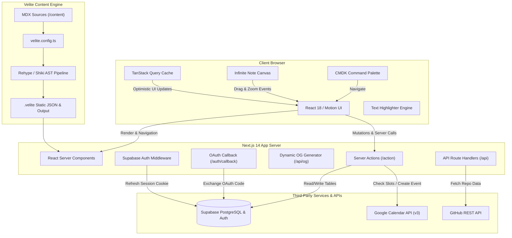
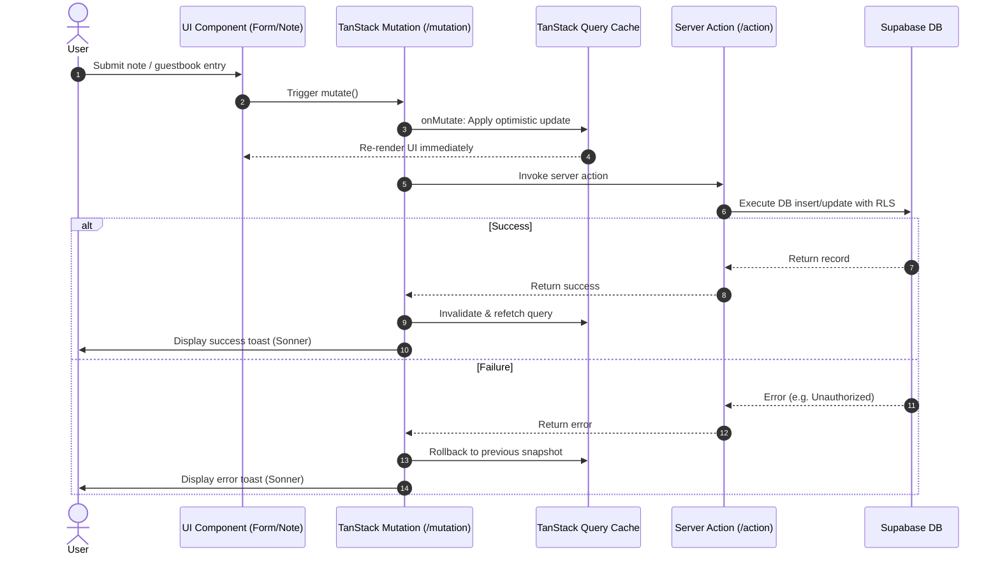
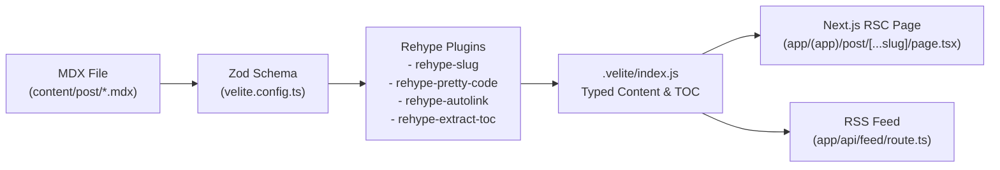
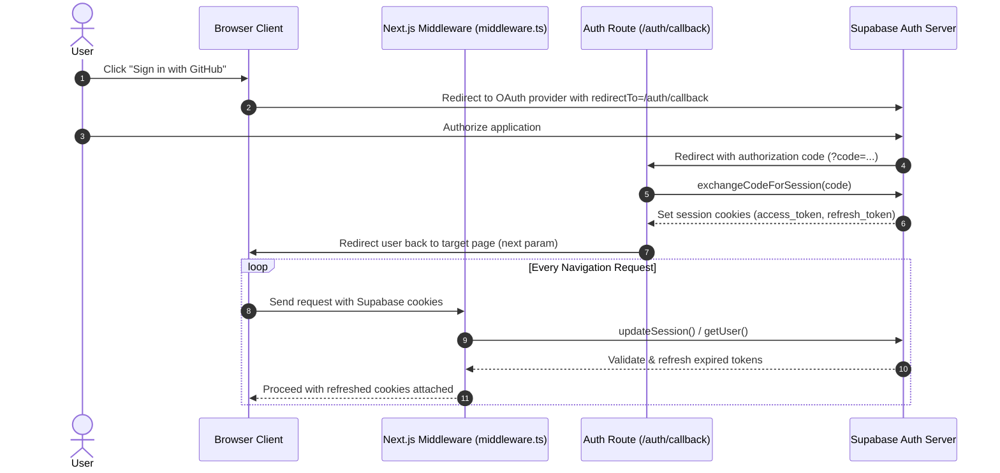

# Architecture & System Design

This document details the system architecture, component relationships, data flow models, and integration mechanisms powering **Salmoon** (`msafdev`).

---

## 🏗️ High-Level System Architecture

---

## 🧩 Architectural Layers

### 1. Presentation & Interaction Layer

- **React Server Components (RSC)**: Used by default for all page components (`app/(app)/**/page.tsx`), static layouts, and SEO metadata generation (`generateMetadata`).
- **Interactive Islands (`use client`)**: Used for components requiring DOM access, pointer interactions, client-side state, or animation hooks:
  - Sticky Note Canvas (`useCanvasDrag`, `useStickyNotes`)
  - Command Palette (`cmdk`, `useDebouncedValue`)
  - Floating Dock navigation (`motion/react`, `useTheme`)
  - Form interactions (`formik`, `zod-formik-adapter`)
  - Text selection highlighter (`window.getSelection`, `document.createTreeWalker`)

### 2. State & Mutation Architecture

The application decouples client mutations from server mutations:

- **Server Actions (`/action`)**: Pure server-side logic executed via Next.js Server Actions (`use server`). They handle authentication checks, validation, database operations via `@supabase/ssr`, and Google API requests.
- **Query Hooks (`/query`)**: Client-side data fetching encapsulated in TanStack Query hooks (`useNote`, `useGuestbook`, `useGithubRepo`).
- **Mutation Hooks (`/mutation`)**: TanStack `useMutation` hooks wrapping server actions or direct Supabase client calls. These provide:
  - **Optimistic UI updates** (`onMutate`)
  - **Automatic cache invalidation** (`onSuccess`)
  - **Context rollbacks** (`onError`)
  - **Standardized user feedback** via `sonner` toasts

---

## 🗄️ Content Pipeline (Velite & MDX)

Content is managed using [Velite](https://velite.js.org/), an ahead-of-time content compiler that validates frontmatter with Zod schemas and processes MDX files into type-safe JavaScript modules:

### Content Collections

1. **`Post` (`content/post/**/\*.mdx`)\*\*: Blog posts, technical articles, and musings. Includes tags, featured flags, reading estimates, and automatic table-of-contents extraction.
2. **`Project` (`content/project/**/\*.mdx`)\*\*: Portfolio case studies with technology stack badges, project links, and screenshots.
3. **`Swift` (`content/swift/**/\*.mdx`)\*\*: SwiftUI component catalog entries with source code, preview tabs, and implementation notes.

---

## 🔐 Authentication & Session Management

Authentication is powered by **Supabase Auth** with OAuth providers (GitHub & Google):

---

## 📅 Google Calendar Availability Engine

The `/contact` and `/mentorship` booking flows integrate with the **Google Calendar API v3** using a service account:

1. **Slot Generation**: Given a target date, `buildDateSlots()` constructs predefined 20-minute consultation windows between `09:00` and `20:00` in the `Asia/Jakarta` timezone.
2. **Conflict Resolution**: `calendar.events.list()` queries all scheduled events in the target date range. Slots intersecting existing calendar events are removed.
3. **Event Booking**: `createMeeting()` constructs an event payload including client contact details, selected services, budget, and custom message, scheduling the event with email notifications.

---

## 🖼️ OpenGraph & Feed Generation

- **Dynamic OpenGraph Images**: Built using Next.js `ImageResponse` (backed by `@vercel/og` / Satori). Endpoints at `/api/og`, `/api/og/post`, and `/api/og/lab` dynamically render PNG cards matching the dark/light aesthetic.
- **RSS / Atom Feed**: Built with `rss` in `app/api/feed/route.ts`, publishing all published blog posts as standard XML for RSS readers.
