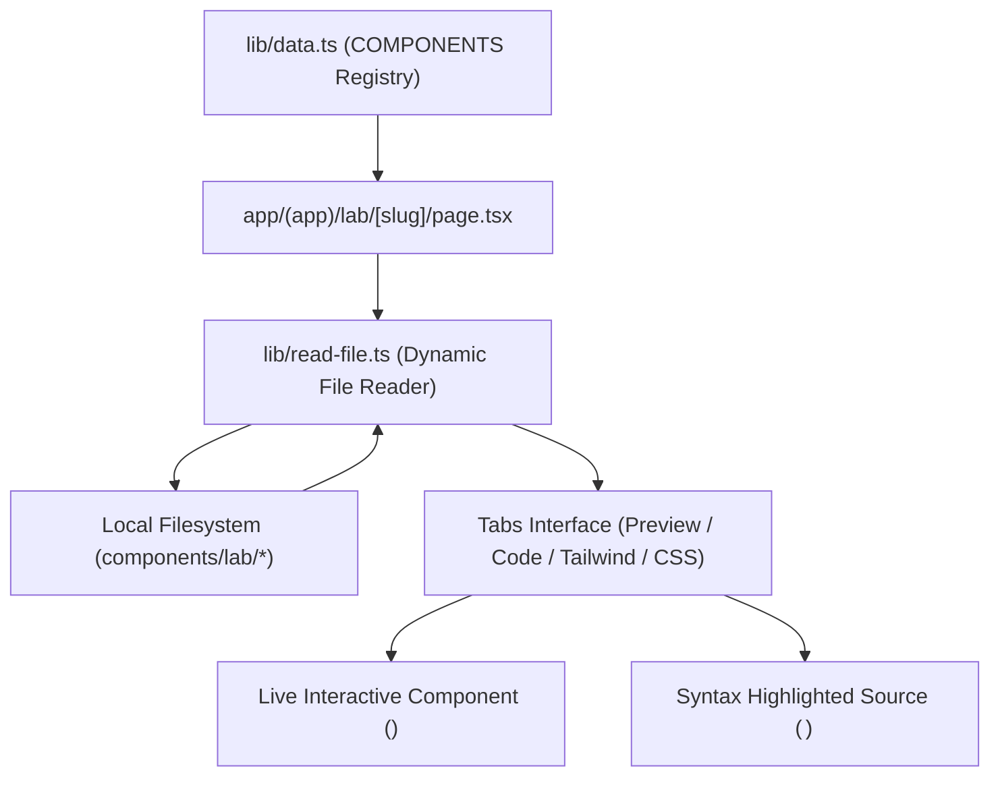
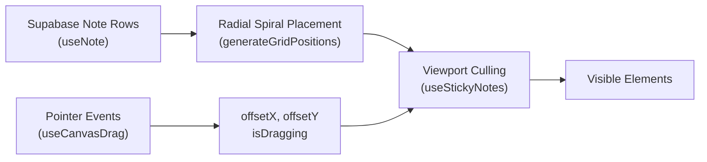
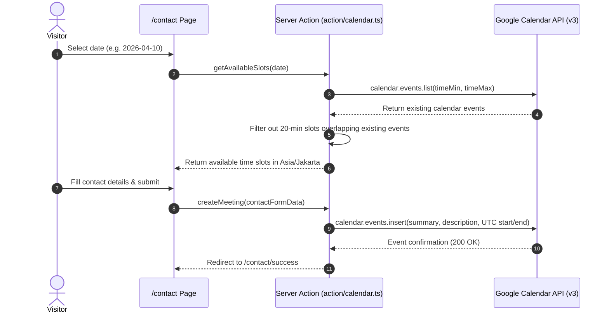

# Feature Deep-Dives

This document provides deep technical explanations of the core features and advanced engineering implementations in **Salmoon** (`msafdev`).

---

## 🧪 1. Interactive UI Laboratory (`/lab`)

The UI Laboratory is a modular showcase for UI components, micro-interactions, and animations.



### Key Technical Details

1. **Dynamic File Reader (`lib/read-file.ts`)**: Rather than duplicating source code strings, the server reads the actual source `.tsx` files directly from disk via Node `fs/promises`, guaranteeing that displayed code is always identical to production code.
2. **Component Registry (`lib/data.ts`)**: Defines metadata, example subcomponents, thumbnail indices, required Tailwind keyframe configs, and external credit links for each lab experiment:
   - `Stagger`, `Badge`, `Avatar`, `Toolbar`, `Input`, `Select`, `Cursor`, `File`, `Loader`, `Timeline`, `Tree`.

---

## 📌 2. Infinite Canvas Sticky Note Board (`/note`)

The `/note` route is an interactive, draggable infinite canvas where authenticated visitors can post colored sticky notes that arrange themselves dynamically across an infinite Cartesian grid.



### 1. Radial Spiral Grid Placement (`generateGridPositions`)

Instead of fixed coordinates, notes are placed organically outward from the origin `(0, 0)` in concentric square perimeters, sorted by Euclidean distance and polar angle:

```typescript
// hooks/use-note.ts
export function generateGridPositions(notes: SupabaseNote[]): Note[] {
  // 1. Places first note at (0, 0)
  // 2. Iterates outward by radius: 1, 2, 3...
  // 3. For each perimeter, generates coordinate pairs (x, y)
  // 4. Sorts perimeter coordinates by Math.sqrt(x^2 + y^2) and Math.atan2(y, x)
  // 5. Assigns unique gridX and gridY to each incoming note
}
```

### 2. Viewport Boundary Culling

To maintain high frame rates with hundreds of notes, `useStickyNotes` calculates the screen-space bounding box for every note and culls elements outside the visible viewport with a 150px padding margin:

$$\text{pixelX} = \text{note.gridX} \times \text{gridSize} + \text{offsetX} + \text{centerX}$$
$$\text{pixelY} = \text{note.gridY} \times \text{gridSize} + \text{offsetY} + \text{centerY}$$

---

## 📖 3. Guestbook with Threaded Nested Replies (`/guestbook`)

The guestbook allows visitors to leave public messages and replies with GitHub or Google OAuth identity.

### Relational Hierarchy Tree Builder (`attachReplies`)

Database entries store flat rows with optional `parent_id` foreign keys. `query/guestbook.tsx` transforms flat data into a nested tree in $O(N)$ time:

```typescript
// query/guestbook.tsx
const attachReplies = (
  entries: GuestbookWithUser[],
): GuestbookWithReplies[] => {
  const parents = new Map<string, GuestbookWithReplies>();
  const replies: GuestbookWithUser[] = [];

  for (const entry of entries) {
    if (!entry.parent_id) {
      parents.set(entry.id, { ...entry, replies: [] });
    } else {
      replies.push(entry);
    }
  }

  for (const reply of replies) {
    const parent = parents.get(reply.parent_id!);
    if (parent) parent.replies.push(reply);
  }

  return Array.from(parents.values());
};
```

---

## 📅 4. Consultation & Mentorship Booking Engine

Available on `/contact` and `/mentorship`, allowing prospective clients or mentees to book consultations directly into Google Calendar.



---

## 🔍 5. Global Command Palette (`cmdk`)

Accessible via <kbd>Cmd</kbd> + <kbd>F</kbd> / <kbd>Ctrl</kbd> + <kbd>F</kbd> from any page:

- **Instant Search**: Indexes all static pages (`/archive`, `/lab`, `/guestbook`, `/note`, `/material`, etc.) and dynamically discovered laboratory components.
- **Debounced Filter**: 250ms debounce prevents rendering lag.
- **Keyboard Traversal**: Full arrow key navigation and <kbd>Enter</kbd> execution.

---

## 🖼️ 6. Dynamic OpenGraph Generator & RSS Feed

### 1. Satori OpenGraph Card Engine

- `/api/og`: Dynamic banner with brand title and bio.
- `/api/og/post`: Renders blog post title, author avatar, and publication date.
- `/api/og/lab`: Renders laboratory component title and interactive badge.

### 2. RSS Atom Feed (`/api/feed`)

Generates a valid RSS 2.0 XML document containing all published Velite posts, complete with full description, category tags, and permanent URLs.
